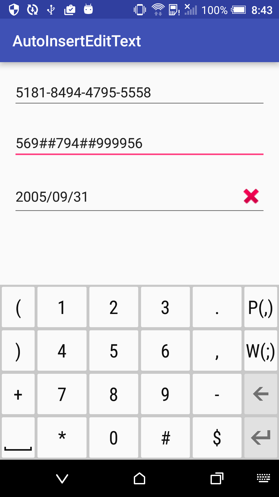

# AutoInsertEditText
Auto insert text into EditText.<br/>
AutoAddTextWatcher will insert text into EditText at positions you are setted.<br/>
AutoAddTextWatcher will delete text in EditText at positions you are setted, when text length bigger than 1.
<br/><br/>

Installation
-----------
Gradle
```Java
compile 'tw.henrychuang.lib:auto-insert-edittext:1.0.1'
```
Maven
```Java
<dependency>
  <groupId>tw.henrychuang.lib</groupId>
  <artifactId>auto-insert-edittext</artifactId>
  <version>1.0.1</version>
  <type>pom</type>
</dependency>
```

<br/>

How to Use
-----------
Add char at positions
```Java
mEditText_creditCard.addTextChangedListener(new AutoAddTextWatcher(mEditText_creditCard,
                "-",
                4, 8, 12));
```

Add and delete chars at positions
```Java
mEditText_multiChars.addTextChangedListener(new AutoAddTextWatcher(mEditText_multiChars,
                "##",
                new int[]{3, 6}));
```

Add char at positions, and callback listener
```Java
mEditText_birthday.addTextChangedListener(new AutoAddTextWatcher(mEditText_birthday,
                "/",
                new TextWatcher() {},
                4, 6));
```

<br/>

ScreenShot
-----------


<br/>

License
-------
Apache License Version 2.0
http://apache.org/licenses/LICENSE-2.0.txt
